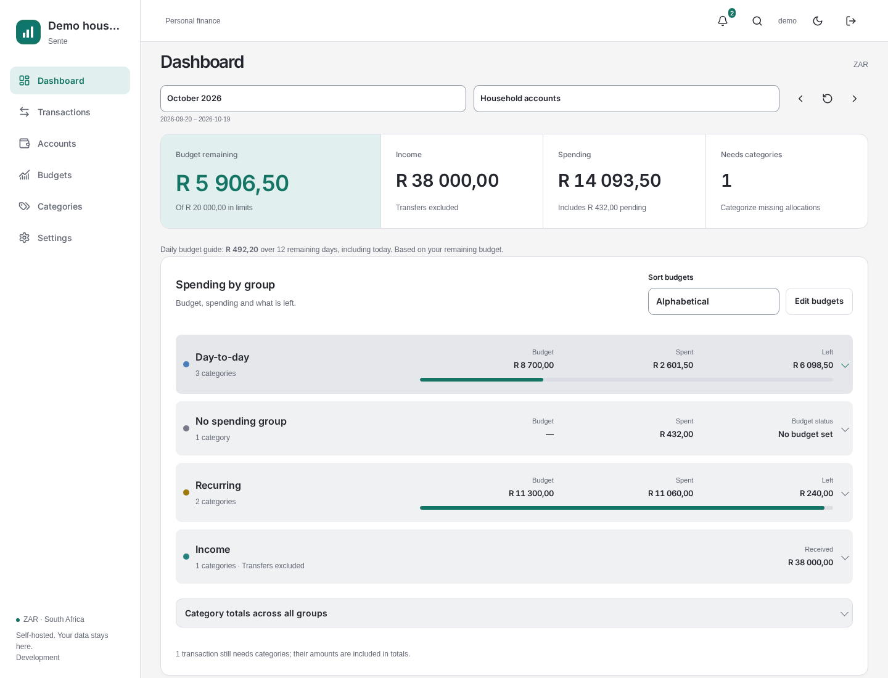
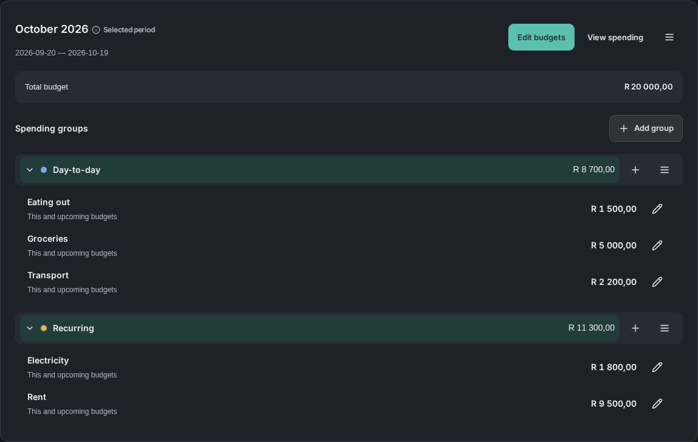
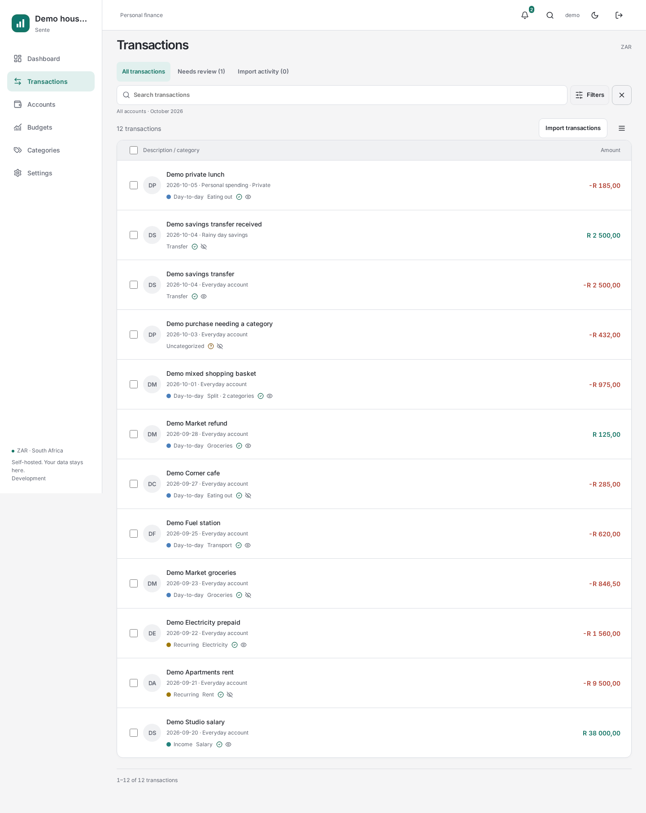
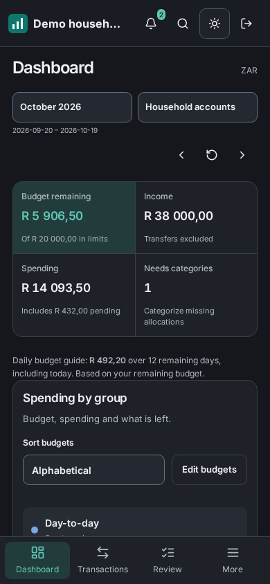

# Sente

**Your household finances, in one place.**

Sente is a self-hosted finance app for South African households. See where your money goes, plan your next budget and keep shared finances together while personal accounts stay private. Built around rand amounts and local budget periods, it runs on your own server.

[Get started](#get-started) · [Take a look](#take-a-look) · [Setup guide](docs/SETUP.md)



*All screenshots use an invented demo household. No real financial data is shown.*

## Make room for what matters

- **Know what is left.** See income, spending and remaining budget at a glance, with a daily budget guide for the rest of your period.
- **Budget your way.** Set limits by spending group and category, carry them into future periods and choose personal budget alerts.
- **Spend less time sorting.** Import FNB statements, categorize with rules and focus your review on transactions that need attention.
- **Keep the whole picture.** Split purchases, account for refunds and move money between accounts without inflating your spending.
- **Share on your terms.** Bring household accounts together, control access to personal accounts and keep your data on your own server.

## Take a look

### A budget that fits your household

Plan everyday spending and recurring bills in the same budget. Add categories, adjust their amounts and decide which limits carry forward.



### From statements to a clear spending history

Search and filter your transactions, see splits and transfers, and find purchases that still need a category. FNB CSV, OFX and ZIP statement uploads are supported.

<details>
<summary>See the transaction ledger</summary>



</details>

### At home or on your phone

Use light or dark mode, with layouts that adapt to desktop and mobile. Install Sente as a web app on supported browsers.

<details>
<summary>See the mobile dashboard in dark mode</summary>



</details>

## Get started

You will need Docker Engine and the Compose plugin on your server.

```bash
git clone https://github.com/DouwJacobs/sente.git
cd sente
cp .env.example .env
# Set PUBLIC_URL in .env to the exact address you will use in your browser.
docker compose up -d --build
```

For local use, open [http://localhost:8080](http://localhost:8080) and create your first administrator. Complete setup before making the installation accessible to others.

1. Import the optional [Sente starter configuration](https://github.com/DouwJacobs/sente-config), or create your own categories and rules.
2. Add your accounts and choose which are shared with your household.
3. Upload an FNB statement in **Transactions → Import activity**.
4. Set your budget limits and review purchases with missing categories.

The [setup guide](docs/SETUP.md) covers configuration, image channels, importing, backups and recovery. For access beyond your own computer, follow the [HTTPS reverse proxy guide](docs/REVERSE-PROXY.md).

## Connect and explore

Compatible AI assistants can connect through MCP with permissions you choose. Read-only access is the default; proposed changes can be reviewed in Sente. See [MCP setup and permissions](docs/MCP.md).

Optional live FNB connections can discover accounts, refresh balances and fetch recent posted transactions. They need a separate browser runtime and bank compatibility checks. See [FNB runtime setup](docs/FNB-RUNTIME.md); statement uploads work independently.

Want to explore with invented data? Follow the [local demo guide](docs/DEMO.md).

For contributors, the [development guide](docs/DEVELOPMENT.md) and [documentation index](docs/README.md) cover architecture, product behavior and verification.

## License

Sente is licensed under [GNU GPL v3](LICENSE), without warranty. You may modify, fork and sell it under the GPL terms. Preserve [upstream attribution](NOTICE) and provide corresponding source when distributing covered binaries. See [release channels, compatibility and recovery](docs/RELEASES.md).
